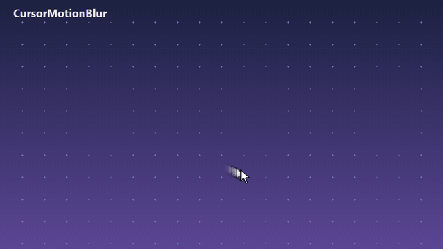

# CursorMotionBlur

A tiny Windows tray app that adds a **live motion blur to your mouse cursor**, system-wide, like macOS.



*Recorded off a real screen on a 120 Hz monitor, with trail opacity 90% and a 30 ms trail, which is about what the defaults are now (everything is adjustable live in Settings). A GIF tops out at 50 fps, so here is the [smoother 120 fps video](assets/demo-120fps.mp4).*

- Fading blur trail behind the cursor, drawn in real time at your mouse's polling rate
- Optionally hides the real cursor when you move very fast, so only the blur remains
- Works across multiple monitors with different resolutions and display scaling
- Lightweight: a single ~40 KB `.exe` (nothing else to download or keep next to it), no installer, no runtime to install (uses the .NET Framework already in Windows 10/11), about 1% of one CPU core while idle

## Use it

1. Download `CursorMotionBlur.exe` from the [Releases](../../releases) page and run it.
2. A settings window opens on first run. Everything applies instantly, so tune it by moving the mouse.
3. It lives in the system tray. Right-click the icon for **Enabled / Settings / Exit**, or press **Ctrl+Alt+B** anywhere to toggle it (you can change this shortcut in Settings).

| Setting | What it does |
| --- | --- |
| Trail opacity | How solid the blur is right behind the pointer (1-100%); it fades to nothing at the far end of the trail |
| Trail length | How far back in time the blur reaches (10-150 ms) |
| Hide the real cursor when moving very fast | Swaps the system cursors for an invisible one above the chosen speed, then restores them. The speed is in cm/s on screen (using each monitor's reported physical size), so it feels the same on small and big monitors |
| Toggle hotkey | The global on/off shortcut (default Ctrl+Alt+B). Click the button, then press the new keys; it needs Ctrl, Alt or Shift, and Esc cancels. If another program already uses the combination you are told and the old one stays |
| Pause in fullscreen apps and games | Switches the blur off while a fullscreen app or game is in front, and back on afterwards (on by default). The hotkey still works |
| Quality | The most cursor copies drawn per frame: Fast 35, Balanced 70 (default), Smooth 100. Higher is smoother in very fast movement but uses more CPU; at slow and normal speeds all three look the same |
| Launch when Windows starts | Adds or removes a per-user startup entry |
| Check for updates | Shows the version (also in the window title) and, only when you click, looks up the latest release on GitHub. The app never connects to the internet on its own |

Settings are stored in `%APPDATA%\CursorMotionBlur\settings.ini`.

### If the cursor ever stays invisible

CursorMotionBlur restores your cursors on exit, on crash and on the next start. If something still goes wrong, just run `CursorMotionBlur.exe` again, or open *Mouse > Pointers* in Windows settings and click OK.

## Build from source

Needs only Windows 10/11 (the C# compiler ships with Windows):

```powershell
powershell -ExecutionPolicy Bypass -File build.ps1
```

The result is `dist\CursorMotionBlur.exe`. `tools\make-icon.ps1` regenerates `assets\icon.ico`.

## How it works

A layered, click-through, always-on-top window draws fading copies of the current cursor image along its recent path. Cursor positions are sampled at about 500 Hz, and a frame is drawn for every new mouse position. For the "hide when fast" option the app replaces the static system cursors using `SetSystemCursor` and restores them with `SystemParametersInfo(SPI_SETCURSORS)`.

## Known limit: the blur trails slightly behind the pointer

Windows draws the real mouse pointer at the last possible moment, but any ordinary window (this overlay included) goes through the desktop compositor and appears one to two screen refreshes later. So the front of the blur sits a little behind the pointer, by roughly 10-17 ms of movement, and the faster you move the bigger the gap in pixels. This is why the app can hide the real pointer during very fast movement (the "hide above speed" setting).

Measured from real screen recordings on a 120 Hz monitor (pointer about 25 px wide), how far the front of the blur trails behind the pointer:

| Pointer speed on screen | Gap, in pointer widths |
| --- | --- |
| 15-30 cm/s | about 0.6-1.2 |
| 30-45 cm/s | about 1.3-1.9 |
| 45-60 cm/s | about 1.8-2.5 |
| 60-90 cm/s | about 2.3-3.6 |
| 90+ cm/s | about 3.8 |

These numbers are rough (the test movements were scripted back-and-forth sweeps, so the speed was not perfectly steady). Predicting where the pointer is heading was tried and did not work well for fast curved movement, so it is not part of the app.

## License

Public domain ([Unlicense](LICENSE)). Anyone can use, copy, modify or sell it, no strings attached.


